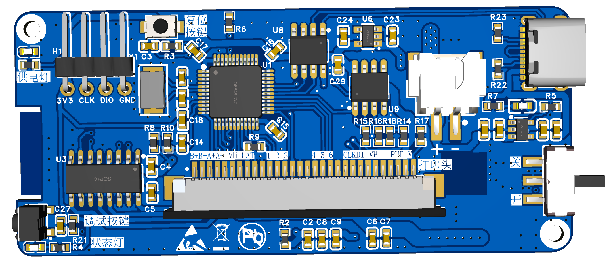
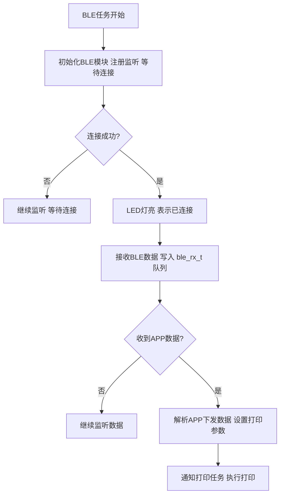
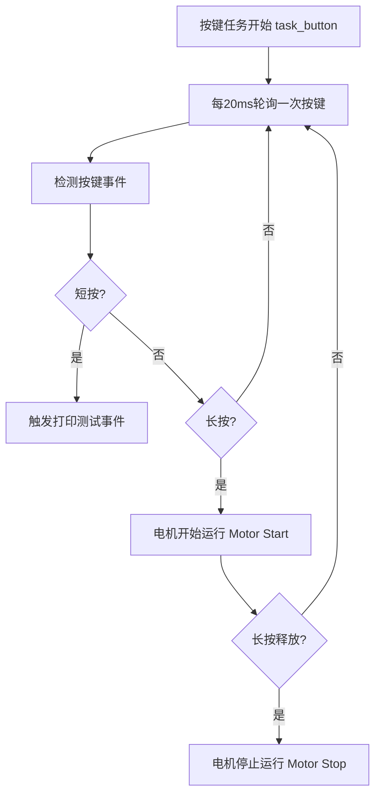
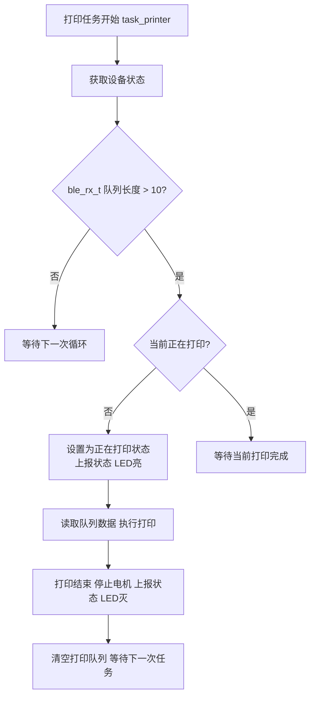
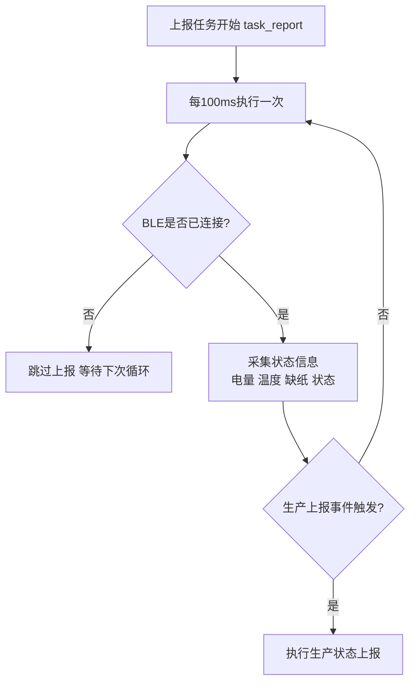

## 0. 介绍
- 一款手持stm32蓝牙热敏打印机，打印大小50x40,可打印单词、标签、留言等。
## 1.硬件
- **芯片**：STM32F103CBT6 FLASH:128K RAM:20K
- **BLE**: 选用智汉RC6621A
- **电源**：可充电锂电池
- **打印模组**：精芯1_JX-2R-01
- **PCB**:
- 
## 2. 软件架构
#### 分层设计
| 模块目录        | 说明                                    |
| ----------- | ------------------------------------- |
| **Core/**   | 系统入口、外设初始化、任务调度与启动 FreeRTOS           |
| **SYSTEM/** | 管理系统任务、队列、软件定时器、统一设备接口；协调 HAL 层与 RTOS |
| **HAL/**    | 对底层外设的逻辑封装。                           |

### RTOS多任务层分析
- 分为四个任务：
	- BLE任务
	- 按键创建任务
	- 打印任务
	- 状态上报任务
#### BLE任务

#### 按键创建任务

#### 打印任务

#### 环形缓冲区RTOS（安全队列实现）
- 用 **互斥信号量 (Mutex)** 实现一个线程安全的 BLE → 打印机 缓冲区队列。
- 该函数采用信号量保护的读取操作，避免与写线程冲突。使用 10 tick 超时等待，防止死锁。通过读写指针实现环形读取，返回数据指针供打印机任务使用。
#### 状态上报任务

## 蓝牙控制
- 使用b站up小智学长蓝牙手机app